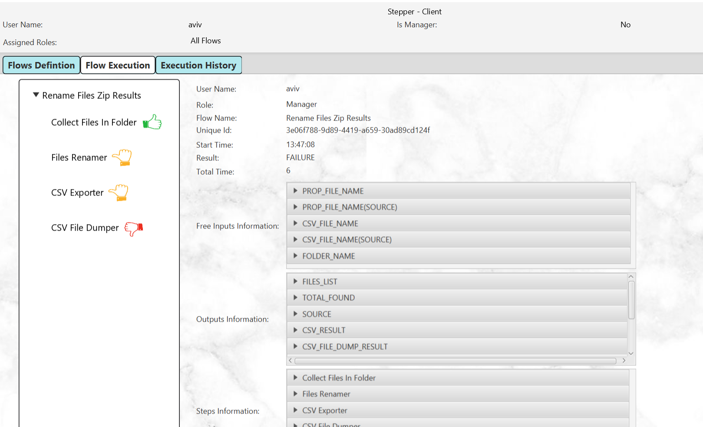
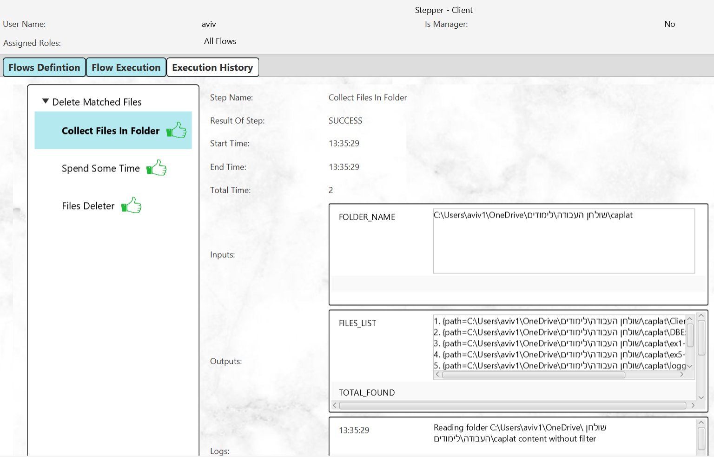
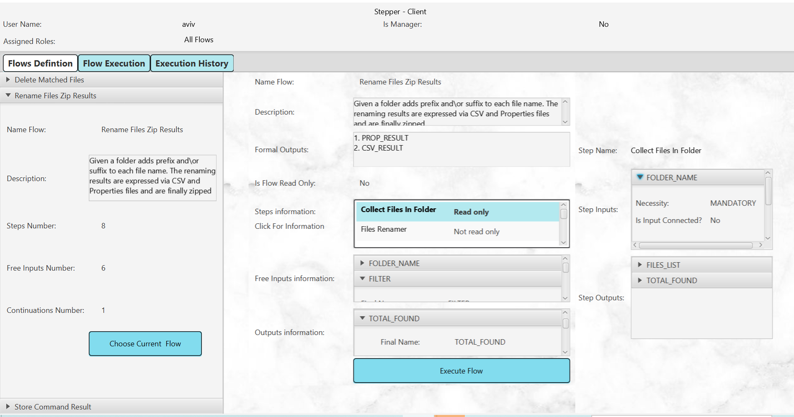
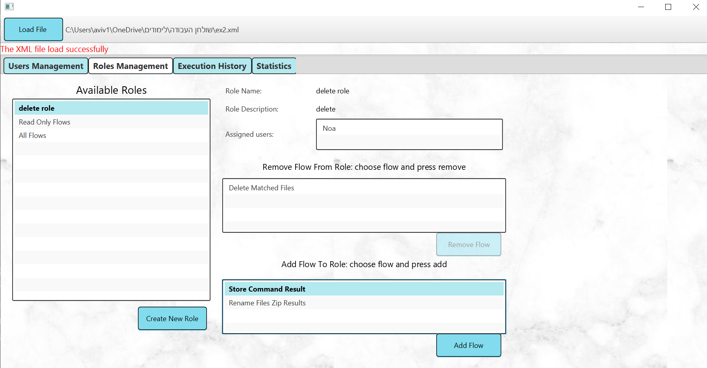
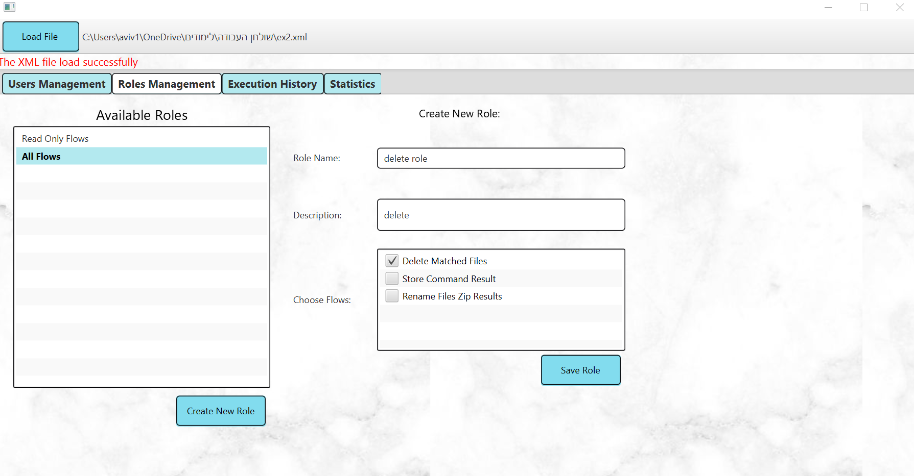

# Stepper Project
## Overview
Stepper is a generic workflow engine designed to allow non-technical users to define and execute various operational processes through a simple, uniform interface. It is built around the concept of reusable, independent units of logic called Steps, each performing a specific task (e.g., deleting a file, running a command). Steps can be connected via inputs and outputs—similar to how LEGO bricks connect—forming a Flow that represents a complete operational scenario. By combining different steps, users can build and run flexible workflows to automate complex processes efficiently.

This project demonstrates advanced Java development skills, focusing on modularity, GUI integration, and effective data management.

---
## Architecture

Stepper is built as a Java-based monolithic web application, packaged as a .war file and deployed on an Apache Tomcat servlet container.

The application follows a layered architecture:

Presentation Layer – RESTful endpoints exposed via Tomcat, accessible by both admin and client users.

Logic Layer – Core logic is managed by a central Utils component, which handles the orchestration of steps, flows, and data transfers.

Data Transfer Layer – Communication between layers (and with external clients) is handled using well-structured DTOs (Data Transfer Objects), allowing clean separation of internal logic from exposed interfaces.

Data Layer – Maintains internal models of step definitions, data definitions, step connections, and flow structures.

## Features

1. **Flow Definition and Execution**:
Design flows by assembling reusable components (steps).
Execute flows while tracking progress and collecting runtime data.

2. **Multithreaded Execution**:
Supports simultaneous execution of multiple flows.
Ensures efficient resource utilization and real-time monitoring.

3. **User Management**:
Role-based access control for flow management and execution.
Separate permissions for administrators and regular users.

4. **Data Tracking and Analytics**:
Collect and store data from flow executions.
Generate insights and reports based on historical execution data.

5. **Graphical User Interface (GUI)**:
Intuitive GUI for designing, managing, and executing workflows.
Real-time updates on flow execution status and performance metrics.

6. **Serialization**:
JSON-based serialization for saving and restoring workflows and configurations.

7. **Client-Server Architecture**:
Centralized server for managing flows, users, and data.
Lightweight client applications for interaction.

8. **Error Handling**:
-Comprehensive validation during flow creation and execution.
-Detailed error messages for troubleshooting.

## Technologies and Skills Demonstrated

- Java OOP: Modular design with reusable components.
- Multithreading: Efficient execution of concurrent workflows.
- Client-Server Model: Communication and data exchange between server and clients.
- JSON Serialization: Persistent storage and retrieval of workflows.
- GUI Development: Interactive user interfaces with real-time feedback.
- Role-Based Access Control: Fine-grained permission management.
- Data Analytics: Aggregation and analysis of flow execution data.

## System Architecture

**Engine System**

Workflow Definition: Allows mapping inputs to outputs and defining workflows.
Execution Management: Tracks inputs, outputs, logs, and summaries during workflow execution.
Statistics Collection: Gathers and displays execution data for workflows and steps.

**Graphical User Interface (GUI)**  

The GUI is built with JavaFX and includes:
1. Dashboard: Displays all workflows and their details.
2. Execution Screen: Launch workflows with required inputs and monitor progress.
3. History Screen: View past executions and their detailed results.
4. Statistics Screen: Displays workflow execution data in tables and charts.
   
**Client-Server Architecture**

*Server Features*:
Role Management: Define and assign roles with specific workflow permissions.
User Management: Create and manage user accounts.
*Client Features*:
Workflow Execution: Users can run workflows and view personal execution history.
Role-Based Access Control: Permissions determine accessible workflows.

## Technologies Used
- Java: Core programming language.
- JavaFX: GUI development.
- CSS: Styling for the GUI.
- Multithreading: Enables asynchronous execution.
- Client-Server Model: Supports multiple users with distinct permissions.

## How It Works

**For Administrators**

- Upload flow definition files to the system.
- Manage user roles and permissions.
- View and analyze all user executions.
  
**For Regular Users**
  
- Log in with a unique username.
- Execute authorized flows and view results.
- Access personal execution history and statistics.
  
**For Managers**
  
- Have elevated permissions to access all flows and execution histories

## Execution - regular user 

## History - regular user

## Flow Definitions - regular user

## role manager - Admin 

## create new role - Admin 

